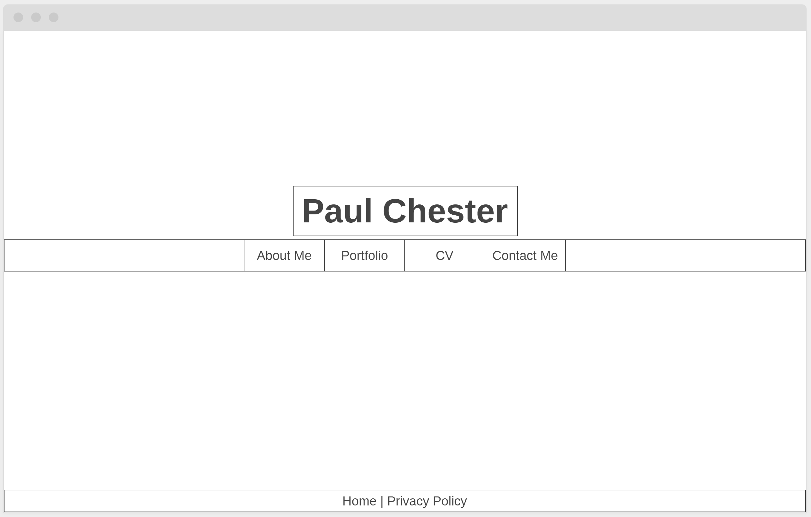
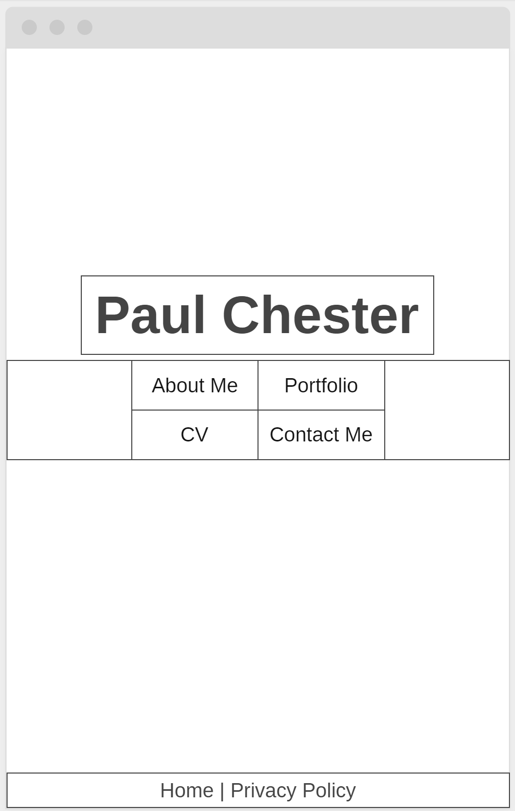
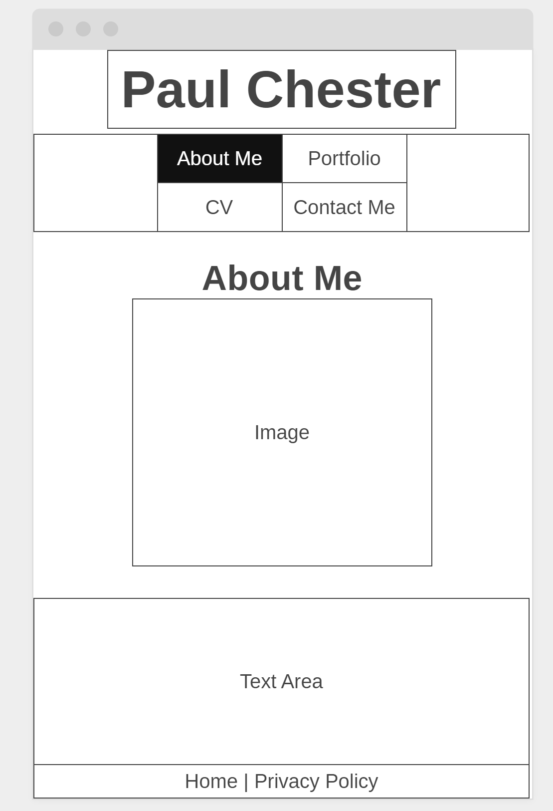
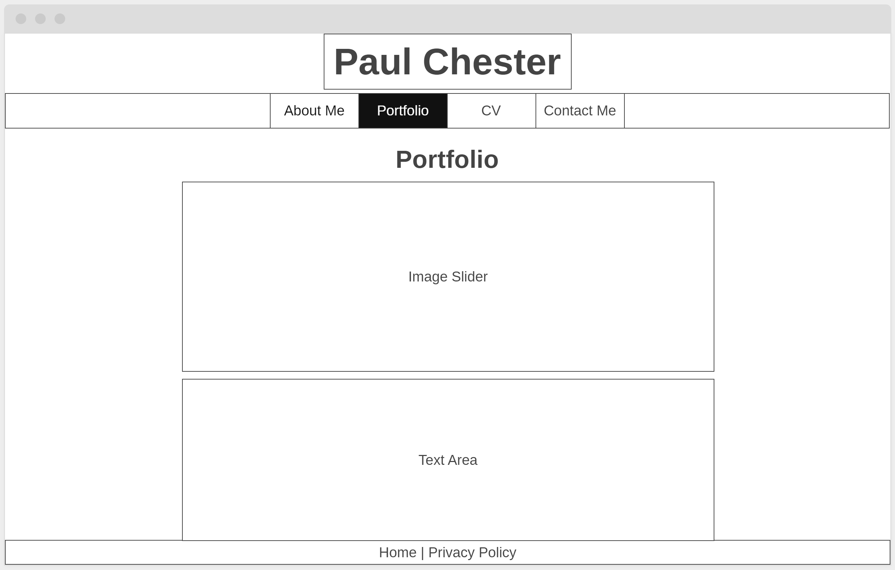
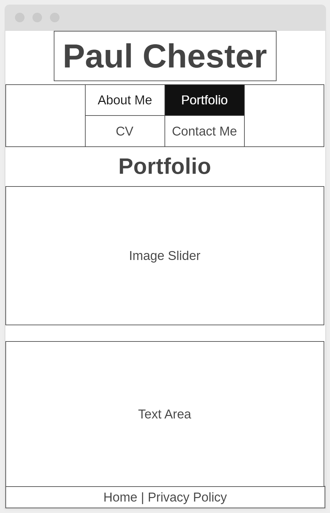
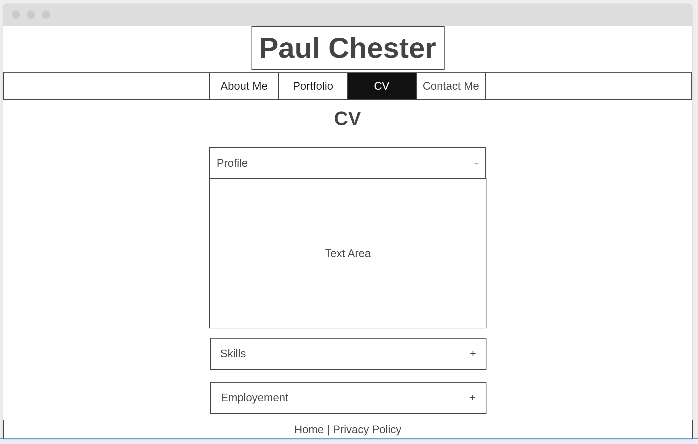
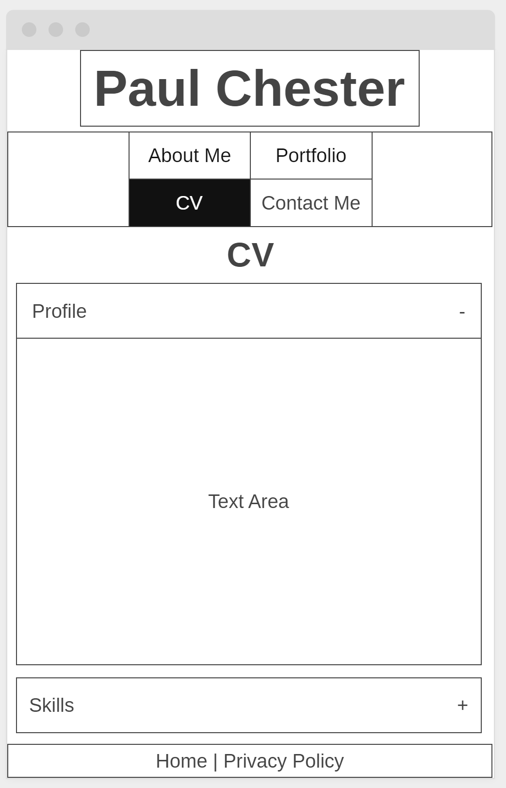
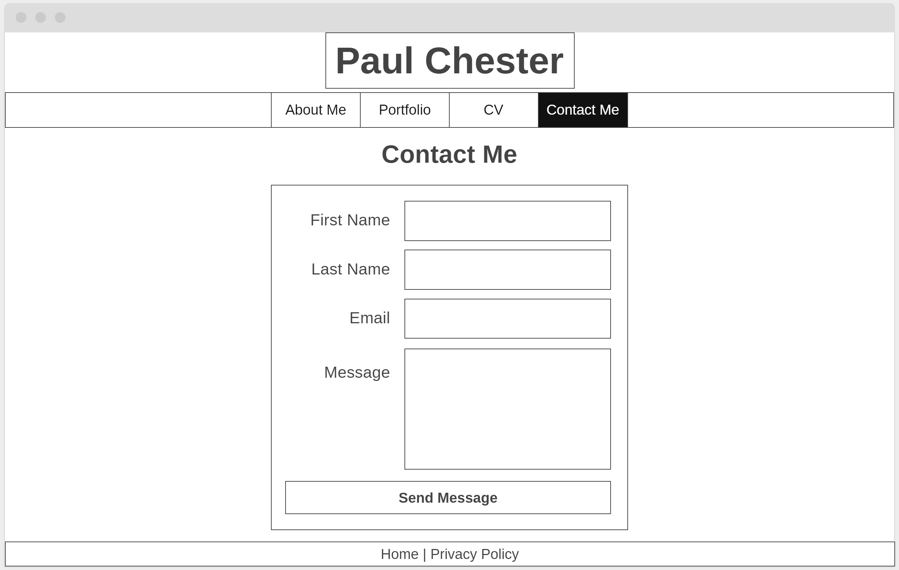
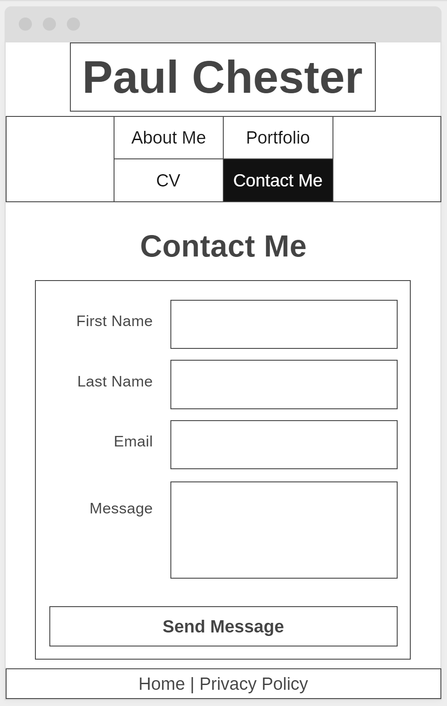

# WEB TECHNOLOGIES (CDA404) Work based Project
## Paul Chester

**Github URL** https://github.com/4CHESP55/Practical_Assessment_1/
**Hosted at** https://4chesp55.github.io/

## Background
Due to the nature of the company I currently work at, I have chosen to create a personal website. The problem it is solving is that I don't currently have a self promotional website to advertise my CV. There is a need for this so in the future is any employers search for me they will be presented with my own website where my CV is stored, along with a way to contact me.

## Wire Frames
**index page wireframe**

**About Me page wireframe**

**Portfolio page wireframe**

**CV page wireframe**

**Contact Me page wireframe**

## Colour Choices
As it's a personal website I have decided on the colour scheme to be mainly greys. This is a neutral colour scheme and so will appear more formal. The colour has also been chosen partly because it is similar to the colours I have decorated my house with and is a colour I prefer.

## Accessibility
### Page title
All page titles are formed by the site name, followed by the page name. This makes them accessable as the web browser will display them in either the tab or the browser window. Other screen reading sofwatre will also be able to read the titles as they are in the head of the document.

### Images
All images on the website have alt text. This allows other software to read the pictures or if the image doesn't load it can be read what the image is of.

### Text
#### Headings
Each page has it's own h1 heading. Other pages which include more headings have a meaningful hierarchy (CV page).
#### Contrast ratio
The constrast ratio on the site is acceptable as text is readable on the light grey background. Where buttons change colour, the text also changes colour if needed to maintain readability.
#### Resize Text
If text is re-sized the website will adjust to keep the correct look and avaoid text overlapping.
### Interaction
#### Keyboard access as visual focus
The website has been tested and by using the tab key the correct fields are highlighted. This allows the entire website to be navigated without a mouse.
#### Forms, labels, and errors
All forms use correct labels and inout types so keyboards can be used to control them.
### General
#### Moving Flashing, or blinking Content
There is no moving, flashing or blinking content. apart from the animations on page transition and CV which last less than 5 seconds.
#### Multimedia alternatives
No audio or video is used on the website.
#### Basic structure check
The basic structure has been checked and is consistant throughout.

## GDPR
There are no cookies on the websites and the only part of the website which needs to conform to GDPR is the contact form. I have added a privacy policy in the footer of ever page which links to the privacy policy page which is a sifficent policy to cover the use of the data obtained in the contact form. There are no other opt-in forms on the website. 

## Distance Selling
The website doesn't sell any goods and as so the distance selling act does not apply.

## Evaluation
I believe I have been able to fully tackle the problem I set out to resolve. However as it’s a website for personal promotion it will be continuously updated with more content.
I started of by designing wireframes to get an idea how I would like to lay out the website. One of the first challenges was making it responsive and transition between pages fluidly. I was able to achieve this by using css classes with transitions along with JavaScript to add or remove the classes on certain actions. The main actions are changing the pages to give the animations of the page transitioning to the next one.
One of the earlier issues I encountered was with the title and nav bar moving, it has to be a fixed position. Because of this the content would display behind it. To solve this I added a top margin for the content to avoid this from happening however on further reflection I imagine there must be a better way to do this without changing how the website functions.
I mainly used google chrome to test the website and changed the screen size within chrome to replicate a smaller screen. As most of the elements are positioned with percentages they automatically resized correctly. However due to how I added a top margin for the content to stop it displaying under the navigation bar, this issue occurred again when the navigation bar increased in height. To fix this I increased the margin size of the content, but only when the screen was a certain width.
Only once I fully finished and tested in google chrome did I host the website with github pages to test on my phone. After testing on my phone I could see everything working correctly.
As the website is simple in both design and content, the main work was around the javascript, mainly the slideshow on the portfolio page. However after researching some examples I felt comfortable implementing it within my website. 
If I were to do this project again I would put more time into the design and how the website looks. Although neutral colours were used, it still gives off the look of blocks of colour.

